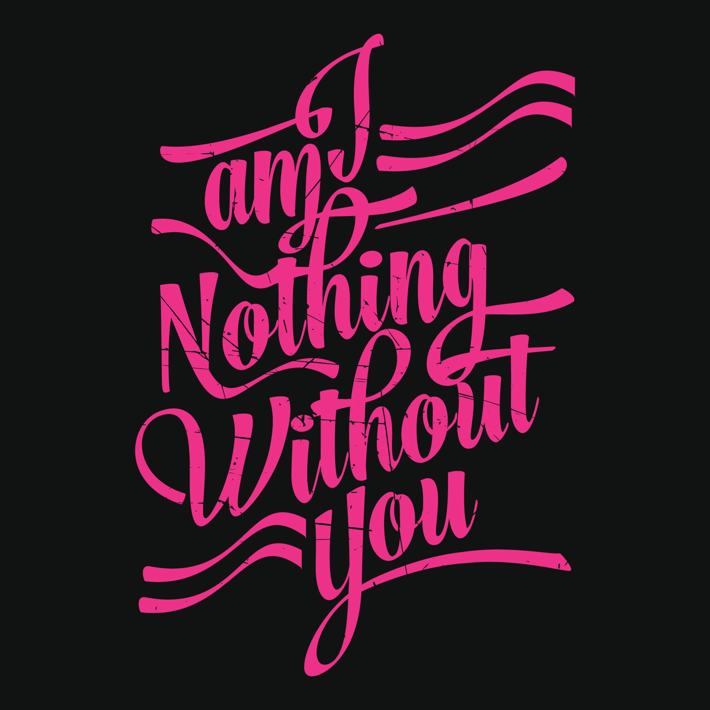

<!--markdown tutorial-->

Kz Numan<br/>
This is new line

---
# Khaza Numan
## Khaza Numan
### Khaza Numan
#### Khaza Numan
##### Khaza Numan
###### Khaza Numan

<p>Hey there my name khaza numan, I am professional Developer in 2023. I am really excited about in future & alwayes prepare for the future direction & dadication.

Thank you   
--wish me luck--</p>
<i>This is an italic text</i>  
_This is an italic text_  
__This is an italic text__

~~this is restricted area~~

<br/>

### italic text
**This is an italic text**

### Single line code
`This is inline code`

<br/>

### Multiple line code
```
    <html>
    <title></title>
    </html>
```
```html
    <html>
    <title></title>
    </html>
```

<ol>
    <li>item1</li>
    <li>item1</li>
    <li>item1</li>
</ol>

<br/>

### Ordered List
1. Item1
2. Item2
    1. Item1.1
    2. Item1.2
3. Item3

<br/>

### Unordered List
- Item1
    - Item1.1
    - Item1.2
- Item2
- Item3

<br/>

### Task List
- [x] Task1
- [x] Task2
- [] Task3

<br/>

### Automatic Link
http://www.replicasdmin.com

### disable link
`http://www.replicasdmin.com`

### markdown link syntex
[Brazzers.com](http://www.youtube.com)

[Mark the link][Hello World]  
[facebook][facebooklink]


<!-- all link is here -->
[Hello World]: [https://www.youtube.com]
[facebooklink]: [https://www.facebook.com]

<br/>

### image syntax

<!--  -->

  

😊
<br/>

### table syntax
| Name | Email |
| ------| ------|
| John | john@gmail.com |
| Khaza Numan | @KzNuman |
| Khaza Numan | kznuman2@gmail.com |

<br/>